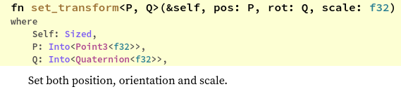

# A fistful of boids - boids in Rust (Part 1)


In this three part blog series, **we will simulate a group of virtual agents (boids) that will swim around an enclosed space behaving like a school of fish**. This is a beautiful application of procedural graphics generation, where _simple rules create complex patterns._ It is almost entirely inspired by Sebastian Lague's [Coding Adventure with boids](https://www.youtube.com/watch?v=bqtqltqcQhw).

We'll be running this is experiment in Rust, in order to

*   break our head have fun with some graphics code
*   get dirty with Rust, which is an awesome programming language
*   feel like a God

By the end of this series, we will have beautiful swirling patterns with a mind of their own. However we must start small. In this part, we will set up our scene and animate a single boid. In the end, you will have something like this.


> Cone points in direction of velocity

* * *

## Pre-requisites

Let's begin by setting up our environment. Skip these steps if you know you've met the requirements.

1.  Install [Rust](https://www.rust-lang.org/tools/install)
2.  Install an IDE. [VS Code](https://code.visualstudio.com/download) works well with Rust.
3.  Add plugins to taste

The code for this project is hosted on a GitHub [repository](https://github.com/twitu/rboids). After each section, any significant additions to the code is tagged and linked in a commit. You can skip over a section and start directly from the source code at that point.

It is expected that you approach this blog with a certain level of programming experience and a basic understanding of Rust. If you're completely new to programming, this might not be the best place to start. If you're new to Rust, briefly going through the [Rust Book](https://doc.rust-lang.org/book/) will certainly help.

While experience with git is not required, it might help with navigating through the different tagged commits of the project.

* * *

## Humble beginnings

In this section, **we will set up our first scene**. `cargo` is the package manager for the Rust ecosystem. Running `cargo new rboids` creates a few files for starting of our Rust project.

```bash
    rboids
    ├── Cargo.lock
    ├── Cargo.toml
    ├── src
    │   └── main.rs
    └── target
        └── debug
```

> Project structure in `rboids` directory

Since this is a visual project, we'll first add the graphics rendering library. We'll use a high level rendering library so as to not get bogged down by low level details. `[three](https://github.com/three-rs/three/)` is perfectly suited for this purpose. Add `three = "0.4.0"` under dependencies in `Cargo.toml` files.

Let's create a window and a camera along with some objects to our scene. We'll edit the `main` function in `main.rs` file.

```rust
    use three;
    use three::Object;
    
    const BACKGROUND_C: u32 = 0xF0E0B6;
    
    fn main() {
        // add window
        let mut win = three::Window::new("rboids - not a flock more");
        win.scene.background = three::Background::Color(BACKGROUND_C);
    
        // add camera
        let cam = win.factory.perspective_camera(60.0, 1.0..1000.0);
        cam.look_at([5.0, 5.0, 5.0], [0.0, 0.0, 0.0], None);
        win.scene.add(&cam);
    
        // add origin
        let origin = {
            let geometry = three::Geometry::uv_sphere(1.0, 12, 12);
            let material = three::material::Wireframe { color: three::color::GREEN };
            win.factory.mesh(geometry, material)
        };
        origin.set_position([0.0, 0.0, 0.0]);
        win.scene.add(&origin);
    
        // start scene
        while win.update() && !win.input.hit(three::KEY_ESCAPE) {
            win.render(&cam);
        }
    }
```

> main.rs

Here's a breakdown of the code snippet:

1.  The `three::Window` is a top level struct which contains all the objects added to the scene. It is taken as a `mut` variable because adding a new object changes its state.
2.  The camera is our eye in the scene. A perspective camera creates the effect of depth i.e. objects located farther, appear smaller. The `look_at` function sets the position of the camera at coordinates `(5, 5, 5)` and points its viewport/lens/eye towards the origin `(0, 0, 0)`.
3.  Adding the origin represents the general style of adding any _mesh_ to the scene. A mesh represents the body of an object. Its _geometry_ is the shape of the skeleton and its _material_ is skin put over the skeleton. In this particular case, the wire-frame material just highlights the lines of the geometry, leaving the object itself transparent. `win.factory.mesh` creates the mesh and applies it to `origin`.
4.  The start scene snippet is the game loop. The game-loop terminates if we hit the `Esc` button or close the window. Any changes made to the scene must be performed inside this loop. The `render` function will then draw these changes on the screen.

The module system for Rust is fairly complex. Right now, all we're doing is importing the `three` module. It contains the `Window` struct, which we access by specifying the full path, namely `three::Window`. Additionally, we import the `Object` trait because it contains the `look_at` method among others. We can use `look_at` with any struct that implements the `Object` trait.

Open a terminal inside `rboids` folder and execute `cargo run`. It might take some time because it is building the project for the first time. The following screen will pop up when compiling is done.


> A sphere at origin

[Tagged version](https://github.com/twitu/rboids/tree/stage_0)

* * *

## Bells and whistles

Let's add a few more objects to our scene. First we need reference points to observe the x, y and z axes. To do this, we need to create 3 more sphere-like origins, the only change being, we set their positions differently.

```rust
        // add axes
        let x_edge = {
            let geometry = three::Geometry::uv_sphere(0.2, 12, 12);
            let material = three::material::Wireframe { color: three::color::MAGENTA };
            win.factory.mesh(geometry, material)
        };
        x_edge.set_position([5.0, 0.0, 0.0]);
        win.scene.add(&x_edge);
    
        let y_edge = {
            let geometry = three::Geometry::uv_sphere(0.2, 12, 12);
            let material = three::material::Wireframe { color: three::color::BLUE };
            win.factory.mesh(geometry, material)
        };
        y_edge.set_position([0.0, 5.0, 0.0]);
        win.scene.add(&y_edge);
    
        let z_edge = {
            let geometry = three::Geometry::uv_sphere(0.2, 12, 12);
            let material = three::material::Wireframe { color: three::color::YELLOW };
            win.factory.mesh(geometry, material)
        };
        z_edge.set_position([0.0, 0.0, 5.0]);
        win.scene.add(&z_edge);
```

> Add reference axes

Let's also add a cone to see what a single boid looks like. A cylinder with 0 radius for one of its ends looks like a cone. The snippet also includes a cone to indicate the blind spot for a boid.

```rust
        // add a solid cone
        let cone = {
            let geometry = three::Geometry::cylinder(0.0, 1.0, 1.5, 12);
            let material = three::material::Basic { color: three::color::BLACK, map: None };
            win.factory.mesh(geometry, material)
        };
        cone.set_position([0.0, 0.0, 0.0]);
        win.scene.add(&cone);
    
        // add a blind spot
        let blind = {
            let geometry = three::Geometry::cylinder(0.0, 1.0, 1.5, 12);
            let material = three::material::Wireframe { color: three::color::RED };
            win.factory.mesh(geometry, material)
        };
        blind.set_position([0.0, -1.0, 0.0]);
        win.scene.add(&blind);
```

> Represent a boid

We'll change a bit of the existing code and also add an orbital controller to the camera. This way we can interact with the scene.

```rust
        // add origin
        let origin = {
            let geometry = three::Geometry::uv_sphere(2.0, 12, 12);
            --- clipped ---
        };
        
        // add orbit controls to camera
        let mut controls = three::controls::Orbit::builder(&cam)
            .position([10.0, 10.0, 10.0])
            .up([0.0, 1.0, 0.0])
            .build();
    
        // start scene
        while win.update() && !win.input.hit(three::KEY_ESCAPE) {
            controls.update(&win.input);
            --- clipped ---
        }
```

> Add bells and whistles to the scene

Here are the changes we made:

1.  We changed the position of the camera and added a controller to it. The `.up` vector tells the controller that the y-axis is to be taken as the upright orientation of the camera
2.  Inside the game loop, we received input from the window and passed it to the controller. This appropriately adjusts the position and orientation of the camera.
3.  We added some reference points, enlarged the origin sphere, and added two cones.

I want to point out that the methods for `Orbit` builder have different types, other than the arguments we used to pass it.


> `position` in trait `Builder`

`position` requires a value of type `<Into<Point3<f32>>` but we passed it into an array of `f32` value. It works because of the `Into` trait. Any type that can be converted to `Point3<f32>` by `Into` is valid. After all this, `cargo run` should create the following scene.


> Interacting with the scene

A single boid is represented by a black cone. The **green sphere is the _vision radius_** and the **red cone is the boid's _blind spot_**. A boid can only see other boids inside its vision radius and ignores them if they're in its blind spot. While this is a handy visualization, we won't be using it when simulating a flock.

You'll also notice that the cone is pointing in the positive y-direction but the sphere has its axis along the z-axis. This is just how the library implements these objects. It will become important when we try to make a boid move in the direction of its velocity.

If you are curious, try changing the velocity of the cone before you move on. Play around with different values. You can start with this snippet.

```rust
        // start scene
        let mut pos: [f32; 3] = [0.0, 0.0, 0.0];
        while win.update() && !win.input.hit(three::KEY_ESCAPE) {
            pos[1] += 0.2;  // changing position along y-axis
            cone.set_position(pos);
            --- clipped ---
```

> Change cone position

[Tagged version](https://github.com/twitu/rboids/tree/stage_1)

* * *

## Best foot forward

Here, **we will give the cone a velocity and change its position**. The [`ncollide3d`](https://www.ncollide.org/rustdoc/ncollide3d/) and `nalgebra` crates will help us with the mathematics. A feature of the Rust module system is that, it allows one module to export an external module. So we'll only add `ncollide3d` to our dependencies as it already exports the `nalgebra` module.

```bash
    --- clipped ---
    [dependencies]
    three = "0.4.0"
    ncollide3d = "0.23.0"
```

> Cargo.toml

All calculations related to velocity, position, and collision of boids will be calculated separately from the graphics and rendering code. Create a new file called `boid.rs` inside the `src` directory. Since this file is in the `src` folder, Rust automatically considers this to be a module named `boid`. Add the following lines to file.

```rust
    use ncollide3d::nalgebra::{Point3, Vector3};
    
    // Scaling factors
    const TIME_SCALE: f32 = 1.0;
    
    /// boid struct is a point with a velocity
    #[derive(Clone)]
    pub struct Boid {
        pos: Point3<f32>,
        vel: Vector3<f32>,
    }
```

> boid.rs

Struct `Boid` has two fields—its position and velocity with types `Point3<f32>` and `Vector3<f32>`, respectively. By explicitly stating the absolute path, we can now use `Point3` and `Vector3` freely inside this module.

Both these types are aliases for more general types. Rust's type system is enforced strictly by the compiler, which can make programming with generic types especially difficult. To avoid writing large generic types, `nalgebra` creates type aliases for commonly used specific types.

The diagram below shows how `Point3` and `Vector3` are derived by aliasing the very general `Matrix` struct. The ovals are type aliases and lead to more general type aliases or structs. Structs are represented by the square boxes.


> The type tree

Alright. Let's add helpful methods to `Boid`. We'll do this by implementing functions inside the `Boid` trait.

```rust
    impl Boid {
        /// create new boid
        pub fn new(pos: Vec<f32>, vel: Vec<f32>) -> Self {
            Boid {
                pos: Point3::from(Vector3::from_vec(pos)),
                vel: Vector3::from_vec(vel),
            }
        }
    
        /// return position as array
        pub fn pos_array(&self) -> [f32; 3] {
            self.pos.coords.into()
        }
    
        /// return velocity as array
        pub fn vel_array(&self) -> [f32; 3] {
            self.vel.into()
        }
    
    	/// update boid for each frame
        pub fn frame_update(&mut self, delta_time: f32) {
            // update position
            self.pos += self.vel * delta_time * TIME_SCALE;
        }
    }
```

> Boid trait

1.  The most important method here is `frame_update`, which takes the time difference between two frames, multiplies with a constant scaling factor, and then adds that fraction of velocity to the position of the boid.
2.  `Vec<T>` is a contiguous growable array type. It is similar to dynamically resizable lists/vectors from other languages. We'll use it to pass position and velocity as arguments when creating a new boid. `Vector3<T>` has a method to create an object from `Vec<T>`.
3.  The other functions act as _getter_ methods that return the `pos` and `vel` fields as an array of `f32` values.

We'll connect all of this with the `main.rs` file. `mod boid` allows us to access the public structs and methods from `boid.rs`.

```rust
    use three;
    use three::Object;
    
    mod boid;
    
    const BACKGROUND_C: u32 = 0xF0E0B6;
    
    fn main() {
    --- clipped ---
    
        // create boid
        let mut boxy: boid::Boid = boid::Boid::new(vec![0.0, 0.0, 0.0], vec![1.0, 0.0, 0.0]);
    
        // start scene
        while win.update() && !win.input.hit(three::KEY_ESCAPE) {
            controls.update(&win.input);
            boxy.frame_update(win.input.delta_time());
            cone.set_position(boxy.pos_array());
            win.render(&cam);
        }
    }
```

> Add boid to scene

The game loop calls `frame_update` to update the position of the boid. It then uses the boid's position to set the position of the cone we're viewing in the scene.


> Moving cone

Voila! You now have a rudimentary animated moving cone.

Notice how the cone is moving along the x-axis but pointing towards the y-axis? That's because we're only updating its position and not its orientation. We'll fix that in the next section.

[Tagged version](https://github.com/twitu/rboids/tree/stage_2)

* * *

## Look where you're going

There is a glaring problem with our animation. The cone did not point in the direction of its velocity. It always points towards the y-axis, which is its default orientation. **Let's fix the cone's orientation by rotating it.** The `[set_transform](https://docs.rs/three/0.4.0/three/trait.Object.html#method.set_transform)` from `three::Object` trait will help us move and rotate the cone in one method.



> set\_transfom method

A [Quaternion](https://youtu.be/d4EgbgTm0Bg) is a 4x4 matrix that is used to represent a 3D rotation. **We'll need to find the rotation from the y-axis to the velocity of the cone.**

```rust
    use ncollide3d::nalgebra::{Point3, Vector3, Vector4};
    use ncollide3d::nalgebra::geometry::UnitQuaternion;
    
    impl Boid {
    	--- clipped ---
    
        /// return rotation from y-axis towards velocity
        pub fn rot_array(&self) -> [f32; 4] {
            let rot: Vector4<f32> = *UnitQuaternion::rotation_between(&Vector3::y_axis(), &self.vel)
                .unwrap_or(UnitQuaternion::from_axis_angle(&Vector3::x_axis(), std::f32::consts::PI),)
                .as_vector();
            rot.into()
        }
    }
```

> Return rotation as an array method in `boid.rs`

The `rotation_between` method takes two vectors and returns a rotation from the first vector to the second. It's type is `Option<UnitQuaternion>` because it fails when both the vectors are exactly opposite to each other. This happens because there are multiple possible rotations.

It will happen when `self.vel` is equivalent to `-Vector3::y_axis()`. We handle failure using `unwrap_or`. If the method returns a valid rotation, we use it. If it fails and returns a `None` value, `unwrap_or` returns a 180 degree rotation around the x-axis. This rotation will transform a vector along positive y-axis to one along negative y-axis.

Let's use this method in the game loop.

```rust
        // create boid
        let mut boxy: boid::Boid = boid::Boid::new(vec![0.0, 0.0, 0.0], vec![0.5, 1.2, 0.0]);
    
        // start scene
        while win.update() && !win.input.hit(three::KEY_ESCAPE) {
            // update camera transform
            controls.update(&win.input);
    
            // compute new boxy velocity and set it
            boxy.frame_update(win.input.delta_time());
            cone.set_transform(boxy.pos_array(), boxy.rot_array(), 1.0);
    
            // render scene
            win.render(&cam);
        }
```

> Set transform for cone

Now we're setting the setting the cone's position and orientation using the methods we defined for a boid.


> Cone points in direction of velocity

Voila! A better-moving cone animation.

[tagged version](https://github.com/twitu/rboids/tree/stage_3)

* * *

## Conclusion

In this part, we:

1.  Set up our environment
2.  Created a graphical scene setup
3.  Created a simple animation of a moving cone

**Things will get more interesting and complex.** Before moving on, play around with the values, tinker around with stuff, and look through the documentation for interesting methods. And if you wanna get your hands dirty, try to change the velocity of the cone.

All criticism and questions are welcome, file an issue at the [repo](https://github.com/twitu/rboids), or comment below with your GitHub account.

[Next part](./for-a-few-boids-more.md)

* * *

## References

1.  [https://github.com/three-rs/three/](https://web.archive.org/web/20200926221449/https://github.com/three-rs/three/)
2.  [https://www.ncollide.org/rustdoc/ncollide3d/](https://web.archive.org/web/20200926221449/https://www.ncollide.org/rustdoc/ncollide3d/)
3.  [Understanding perspective projection](https://web.archive.org/web/20200926221449/https://www.mathematik.uni-marburg.de/~thormae/lectures/graphics1/graphics_6_1_eng_web.html#1)
4.  [Original paper introducing boids](https://web.archive.org/web/20200926221449/http://www.cs.toronto.edu/~dt/siggraph97-course/cwr87/)
5.  [3b1b explains Quaternions](https://web.archive.org/web/20200926221449/https://youtu.be/d4EgbgTm0Bg)

_Originally posted for the BITS ACM blog in May, 20_
