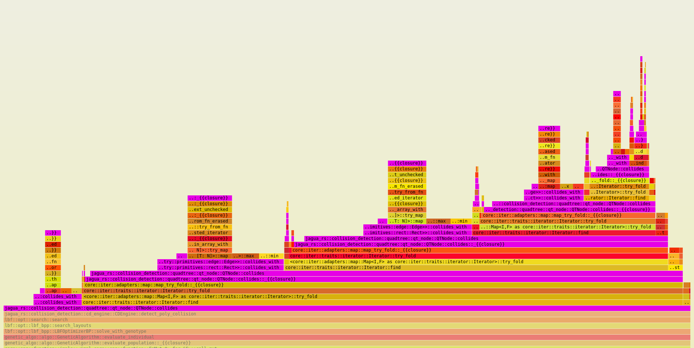

# Flamegraphs 🔥🔥 for Fun and Profit

Flamegraphing is a super powerful tool for profiling your code and finding out what the **actual** bottlenecks are.

* Install [cargo flamegraph](https://github.com/flamegraph-rs/flamegraph)

* Run the following commands that allows perf to access kernel data

  ```
  echo 0 |sudo tee /proc/sys/kernel/kptr_restrict
  sudo sysctl -w kernel.perf_event_paranoid=-1
  ```

* Configure the release profile to add debug symbols and not strip them. If you find your flamegraph has `unknown` functions you need to add the debug symbols in.

  ```
  [release]
  debug = true
  strip = false
  ```
  
* On ubuntu, flamegraph can be very slow because it uses addr2line utility to process the perf data. Installing a (100x) faster implementation is the widley accepted workaround.

  ```
  git clone https://github.com/gimli-rs/addr2line
  cd addr2line
  cargo build --release --examples
  sudo cp /usr/bin/addr2line /usr/bin/addr2line-bak
  sudo cp target/release/examples/addr2line /usr/bin/addr2line 
  ```

For e.g. when optimizing an application built on top of the fantastic bin-packing algorithm library [jagua-rs](https://github.com/JeroenGar/jagua-rs/). Flamegraph showed that bulk of the CPU time (50%+) was spent calculating collisions in a single function deep inside the `jagua-rs` library. This insight helped inform a bunch of improvements in the collision logic for a 15% speedup.



Flamegraph internally uses `perf` for Linux. It's a super powerful tool to trace program execution. [Julie Evans](https://jvns.ca/blog/2016/03/12/how-does-perf-work-and-some-questions/) explains it well.
