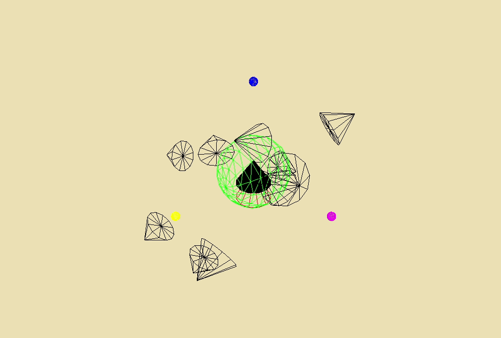
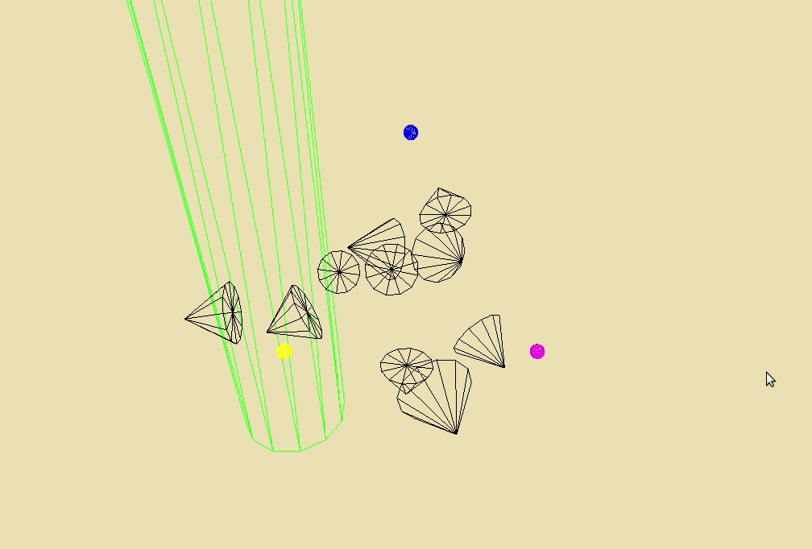

# For a few boids more - boids in Rust (Part 2)


Hello again. In [part 1](./a-fistful-of-boids.md), we began our ambitious experiment of simulating a school of fish. We set up a scene and added some basic animation for a moving cone. Those were baby steps. You can download the project at this stage from this [tagged version](https://github.com/twitu/rboids/tree/stage_3).

In this part, we will,

1.  Generate boids and give them a random velocity
2.  Add the first rule to give boids life

At the end of it our boids will become a little intelligent and behave like this.


> The tranquil pleasure of obstacle avoidance

* * *

## A pinch of randomness

In this section, **we'll generate many boids with and give them a random velocity**. The [`rand`](https://docs.rs/rand/0.7.3/rand/) crate will help us, so add `rand = "0.7.3"` to project dependencies. We'll also use the `UnitSphere` distribution from [`rand_distr`](https://rust-random.github.io/rand/rand_distr/index.html) crate, so add `[rand_distr] = "0.2.2"` to the dependencies as well.

Let's create the `spawn_boids` function in `boid.rs`. At the top of the file, add the following imports and constant values.

```rust
    use rand::{thread_rng, Rng};
    use rand_distr::{Distribution, UnitSphere};
    
    // Scaling factors
    const TIME_SCALE: f32 = 1.0;
    const MAX_VEL: f32 = 4.0;
    const MIN_VEL: f32 = 1.0;
    
    --- clipped ---
    
    impl Boid {
    	--- clipped ---
        
       	pub fn spawn_boids(c: &[f32; 3], r: f32, n: usize) -> Vec<Boid> {
            let centre: Vector3<f32> = Vector3::from_row_slice(c);
            let mut boids: Vec<Boid> = Vec::new();
            let mut rng = thread_rng();
    
    		--- in next section ---
        }
    }
```

> spawn\_boids in boid.rs

This function spawns boids at random points inside a sphere. It takes the following parameters:

1.  `c` - The coordinates for the centre of the sphere
2.  `r` - The radius of the sphere or the bounds inside which boids can be spawned
3.  `n` - The number of boids to spawn

`thread_rng()` initializes a system seeded random number generator. We also intialise a `Vec<Boid>` to collect all the instances we generate.

Here's the next section, where we generate random points for a boid's starting position.

```rust
            --- clipped ---
            
            for _ in 0..n {
                // create position by random offset from centre within given radius
                let off_value = r * rng.gen_range(-1.0, 1.0);
                let coords: [f32; 3] = UnitSphere.sample(&mut rng);
                let offset: Vector3<f32> =
                    Vector3::<f32>::from_row_slice(&coords);
                let pos: Point3<f32> = Point3::from(centre + offset) * off_value;
    
    			--- in next section ---
```

> Randomness to the rescue

Here's what how it works:

1.  `off_value` is any value between positive and negative radius limits
2.  `UnitSphere` is a random distribution which picks a random point on the surface of a unit sphere. It generates a unit vector which represents the offset direction.
3.  We create the `Point3` position of the boid by adding the offset vector to the centre vector. The offset vector is derived by multiplying offset value with offset direction.

Then we generate random velocities.

```rust
                // create random velocity with magnitude between MIN_VEL and MAX_VEL
                let vel_value: f32 = if rng.gen_bool(0.5) {
                    rng.gen_range(MIN_VEL, MAX_VEL)
                } else {
                    rng.gen_range(-MAX_VEL, -MIN_VEL)
                };
                let coords: [f32; 3] = UnitSphere.sample(&mut rng);
                let vel: Vector3<f32> = Vector3::<f32>::from_row_slice(&coords) * vel_value;
    
                // add boid to Vector
                boids.push(Boid { pos, vel })
            }
    
            boids
```

> Give it some velocity

It is similar to generating random positions. A random magnitude and a random direction vector to creates a random velocity. Using the position and velocity, we create a `Boid` and push it into `boids`. To use `spawn_boids` the following changes to `main.rs` are necessary.

1.  Create an equivalent for `spawn_boids` namely `spawn_cones`
2.  Modify the render function to handle a lists of boids and cones

```rust
    use three::{Object, Mesh};
    
    mod boid;
    use boid::Boid;
    
    const BACKGROUND_C: u32 = 0xF0E0B6;
    const SPAWN_CENTRE: [f32; 3] = [0.0, 0.0, 0.0];
    const SPAWN_RADIUS: f32 = 3.0;
    const SPAWN_NUMBER: usize = 10;
```

> Make constants for`spawn_boids` arguments 

Change the imports to freely use `Boid` and `Mesh` struct without the absolute path.

```rust
    fn spawn_cones(win: &mut three::Window) -> Vec<Mesh> {
        let mut cones: Vec<Mesh> = Vec::new();
        for _ in 0..SPAWN_NUMBER {
            let cone = {
                let geometry = three::Geometry::cylinder(0.0, 1.0, 1.5, 12);
                let material = three::material::Wireframe { color: three::color::BLACK };
                win.factory.mesh(geometry, material)
            };
            win.scene.add(&cone);
    
            cones.push(cone);
        }
    
        cones
    }
```

> Create a number of cones

The roles of `spawn_cones` is to:

1.  Create `SPAWN_NUMBER` of cone meshes
2.  Add them to the Window
3.  Push them into a `Vec<Mesh>`
4.  Return the list of meshes

We have not manipulated the `position` or `transformation` of the cone in anyway. We'll do that inside the game loop.

```rust
    fn main() {
    	--- clipped ---
        
        // create boid
        let mut boids: Vec<Boid> = Boid::spawn_boids(&SPAWN_CENTRE, SPAWN_RADIUS, SPAWN_NUMBER);
        let cones: Vec<Mesh> = spawn_cones(&mut win);
    
        // render scene
        while win.update() && !win.input.hit(three::KEY_ESCAPE) {
        	--- clipped ---
    
            // compute new boxy velocity and set it
            boids.iter_mut().for_each(|b: &mut Boid| b.frame_update(win.input.delta_time()));
            boids.iter().zip(cones.iter()).for_each(|(b, c)| c.set_transform(b.pos_array(), b.rot_array(), 1.0));
    
    		--- clipped ---
        }
    }
```

> Game loop renders all the cones

We create a list of boids and cones each. Inside the game loop we update the objects on each frame. This section is perfectly suited for iterator syntax, so bear with me if it's not immediately obvious.

1.  Iterate over each `Boid` in `boids` and call `frame_update` on it. Since `frame_update` mutates the position, the reference must be mutable. `iter_mut` allows this by creating an iterator of mutable references in `boids`.
2.  Next the updated boid is used to set the cone's position and orientation a.k.a transform. `set_transform` does not require a mutable reference so just `iter` will do. However, each cone needs information from its respective boid. To achieve this, zip the boid and cone iterators together. The iterator yields a tuple containing the related boid and cone, which can then be used in `set_transform`.

Finally `cargo run`, shows this cool animation of rockets firing in all directions.



> Firing rockets

We've created most of the graphical parts to simulate a flock of birds. However, we are lacking the most important components that gives life to these boids - the rules to interact with boundaries and each other.

[tagged version](https://github.com/twitu/rboids/tree/stage_4)

* * *

## Finding the right direction

Right now, the boids simply ignore the boundaries of the box. In this section, **we will add the logic to keep boids confined inside an enclosed space**. It is a bit involved so pay close attention.

To do this, we need to create obstacles and a mechanism to detect them. The boids will only move in the unobstructed direction. The `ncollide3d` library will help us here. For obstacles, we'll use shapes that implement the `RayCast` trait. The trait contains the `intersects_ray` method which the boid will use to find an unobstructed direction.


> `intersects_ray` in `RayCast` trait

### The first obstacle

We encounter our first problem when creating a list of obstacle shapes. Let's try to define its type. Suppose we specify a `Vec` that can contain any `struct` that implements `RayCast`.

```rust
    let mut obstacles: Vec<T: RayCast<f32>> = Vec::new();
```

> Won't work

There are many distinct structs that implement the `RayCast` trait. For example, we have the [Cylinder](https://www.ncollide.org/rustdoc/ncollide3d/shape/struct.Cylinder.html), the [Plane](https://www.ncollide.org/rustdoc/ncollide3d/shape/struct.Plane.html), and the [Cuboid](https://www.ncollide.org/rustdoc/ncollide3d/shape/struct.Cuboid.html) among others. **It won't work because a `Vec` can only contain objects of the same type and hence, size.** `T: RayCast` does not tell the compiler anything about memory required by `Cylinder` and `Cuboid`. They might require different amounts of memory. The solution is to use [dynamic dispatch](https://medium.com/digitalfrontiers/rust-dynamic-dispatching-deep-dive-236a5896e49b), which is analogous to virtual functions from languages like Java and C++.

```rust
    let mut obstacles: Vec<Box<dyn RayCast<f32>>> = Vec::new();
```

> Will work

This way, we tell the compiler that each element is a fixed-size pointer i.e. `Box` which points to a struct implementing the `RayCast` trait. `dyn RayCast` tells the compiler that it will have to (dynamically) find out which type of shape is calling `intersect_ray` at run time.

We are not done yet. Shapes are always created at origin. If we want to compute collision with a cylinder at `(10, 0, 0)`, we'll have to translate it before checking for ray collision. So we have a `Vec` containing the pointer to a shape and a related `Isometry` i.e. offset/translation/rotation to be performed.

```rust
    let mut obstacles: Vec<(Box<dyn RayCast<f32>>, Isometry<f32>)> = Vec::new();
```

We'll use this definition to write out a function that creates some obstacles.

```rust
    fn create_obstacles() -> Vec<(Box<dyn RayCast<f32>>, Isometry<f32>)> {
        // create obstacles
        let mut obstacles: Vec<(Box<dyn RayCast<f32>>, Isometry<f32>)> = Vec::new();
        obstacles.push((
            Box::new(Plane::new(Vector3::x_axis())),
            Isometry::translation(-15.0, 0.0, 0.0)
        ));
        obstacles.push((
            Box::new(Plane::new(-Vector3::x_axis())),
            Isometry::translation(15.0, 0.0, 0.0)
        ));
        obstacles.push((
            Box::new(Plane::new(Vector3::y_axis())),
            Isometry::translation(0.0, -15.0, 0.0)
        ));
        obstacles.push((
            Box::new(Plane::new(-Vector3::y_axis())),
            Isometry::translation(0.0, 15.0, 0.0)
        ));
        obstacles.push((
            Box::new(Plane::new(Vector3::z_axis())),
            Isometry::translation(0.0, 0.0, -15.0)
        ));
        obstacles.push((
            Box::new(Plane::new(-Vector3::z_axis())),
            Isometry::translation(0.0, 0.0, 15.0)
        ));
        obstacles.push((
            Box::new(Cylinder::new(25.0, 3.0)),
            Isometry::translation(-10.0, 0.0, 0.0)
        ));
    
        obstacles
    }
```

> Lot of obstacles

We create 6 planes that together create an enclosed cubical space. The cylinder is added just for fun. Note that obstacles are just logically entities that we will use for calculations. To show them in the scene, we will create `Mesh` objects that are similar in shape to obstacles. We'll refactor the code that adds meshes, by moving it to a dedicated function.

```rust
    fn add_objects_to_scene(win: &mut three::Window) {
    	--- clipped axes and other mesh code ---
    
        let mbox = {
            let geometry = three::Geometry::cuboid(30.0, 30.0, 30.0);
            let material = three::material::Wireframe { color: three::color::GREEN };
            win.factory.mesh(geometry, material)
        };
        mbox.set_position([0.0, 0.0, 0.0]);
        win.scene.add(&mbox);
    
        let mcylinder = {
            let geometry = three::Geometry::cylinder(3.0, 3.0, 30.0, 12);
            let material = three::material::Wireframe { color: three::color::GREEN };
            win.factory.mesh(geometry, material)
        };
        mcylinder.set_position([-10.0, 0.0, 0.0]);
        win.scene.add(&mcylinder);
    }
```

> Add mesh for obstacles

Here we simply use a cuboid to visually represent 6 planes. We did not use a cuboid for creating the obstacles because of performance reasons. Ray casting inside solid object like a cuboid is [slower](https://www.ncollide.org/geometric_queries/#ray-casting).

```rust
    fn main() {
    
    	--- clipped ---
    	// add objects to scene
        add_objects_to_scene(&mut win);
    
        // create obstacles
        let obstacles = create_obstacles();
        
        // create boid
        let mut boids: Vec<Boid> = Boid::spawn_boids(&SPAWN_CENTRE, SPAWN_RADIUS, SPAWN_NUMBER);
        let cones: Vec<Mesh> = spawn_cones(&mut win);
        --- clipped ---
    }
```

> modified section for `main.rs`

`main` uses `add_objects_to_scene` and `create_obstacles` functions. `cargo run` should show something like this.



> A glass prison

### I have a ray gun

The boids don't care about the obstacles yet. They need to detect the obstacles and then find the closest unobstructed direction. To do this, a boid will fire off rays in all directions, like the image shown below.


> Image from Sebastian Lague's video on boids

The directions are not random, they are equally spaced on the surface of a sphere. The technique to generate the directions is also taken from Sebastian Lague's code.

```rust
    const RAY_NUMS: usize = 100;
    
    use lazy_static::lazy_static;
    
    lazy_static! {
        static ref RAY_DIRS: [Vector3<f32>; RAY_NUMS] = {
            let mut ray_dirs = [Vector3::new(0.0, 0.0, 0.0); RAY_NUMS];
            
            // initialize ray angles
            let golden_ratio: f32 = 1.618;
            let angle_increment = 3.1415 * 2.0 * golden_ratio;
    
            for i in 0..RAY_NUMS {
                let t: f32 = i as f32 / RAY_NUMS as f32;
                let inclination: f32 = (1.0 - 2.0 * t).acos();
                let azimuth: f32 = angle_increment * i as f32;
    
                let x = inclination.sin() * azimuth.cos();
                let y = inclination.sin() * azimuth.sin();
                let z = inclination.cos();
                ray_dirs[i] = Vector3::new(x, y, z);
            }
    
            ray_dirs
        };
    }
```

> creating a global, read-only array in `boid.rs`

For the purpose of this experiment, you don't need to understand this completely. Just that **the expression samples equally spaced points from the surface of a sphere and stores it in an array**. You can check out the mathematics behind it [here](https://stackoverflow.com/questions/9600801/evenly-distributing-n-points-on-a-sphere/44164075#44164075), and explain it to me sometime.

What's more important is that, we've used a macro called `lazy_static`. Add `lazy_static = "1.4.0"` to project dependencies. We are trying to create a static array of ray directions. These are some things to consider.

1.  The array of ray directions does not change once initialized.
2.  This array does not belong to any one `Boid` instance but can be considered a "class property" from other languages.
3.  Rust forbids `const` variables from containing heap allocated data and `Vector3` is a heap allocated value.
4.  Rust does not allow for loops when declaring a `static` variable. This is to ensure that the amount of memory allocated is known at compile time.

The conclusion is that, we're in a pickle. Rust's strict rules do not allow the common pattern of declaring a static array with dynamically allocated data. `lazy_static` solves this by creating a one-off type that can be intialised only once. The variable still behaves like an array but it is only allocated when accessed for the first time. This solves our problem.


> Non-aligned ray cast sphere and boid velocity

There is one flaw in the directions we created. The first value `RAY_DIRS[0]` is `Vector3::new(0.0, 0.0, 1.0)` i.e. positive z-axis. Rays get equally spaced starting from the positive z-axis. The above image shows a boid with a velocity not aligned with the axis of ray cast sphere. We will need to orient these rays along the boid's velocity before firing them.

Next, we implement the function that does the collision checking. It will perform the following steps:

1.  Check for obstruction. If not obstructed, skip the following steps.
2.  Iterate over all ray directions
3.  Correct the ray direction as per orientation
4.  Construct a `Ray` for the corrected orientation
5.  Iterate over all obstacles and check for intersection with ray
6.  Store and return unobstructed ray direction
7.  Change the boid's velocity

A ray consists of a point and a direction (somewhat like a `Boid`).


> A point with a direction

Firing a ray means extending a line from the `origin` for a specific length along the given `dir`. If the line intersects any shape, it registers a collision. With this information, we can implement the `collided` function.

```rust
    const OBSTACLE_DIST: f32 = 5.0;
    
    /// check if a ray collides with the given obstacles
    fn collided(obs: &Vec<(Box<dyn RayCast<f32>>, Isometry<f32>)>, ray: Ray<f32>) -> bool {
        obs.iter()
            .any(|(shape, iso)| shape.intersects_ray(iso, &ray, OBSTACLE_DIST))
    }
```

> helper function in `boid.rs`

This function iterates over obstacles and returns true if any one of them intersects the given ray . Here `5.0` is the length of the ray and the limit of our collision detection. The next function is `unobstructed_dir`. It finds the closes unobstructed ray direction.

```rust
    impl Boid {
    	--- clipped ---
        
        /// return unobstructed direction closest to current velocity
        fn unobstructed_dir(&self, obs: &Vec<(Box<dyn RayCast<f32>>, Isometry<f32>)>) -> Option<Vector3<f32>> {
        
        --- next section ---
        }
    }
```

> `unobstructed_dir` type signature

Let's see how it works.

1.  It received the list of obstacles and their corresponding translations we created earlier.
2.  There is a very slim possibility that the boid is completely surrounded by obstacles. In this case, the function returns None. This is indicated by its return type `Option<Vector3<f32>>`.

```rust
    impl Boid {
    	--- clipped ---
        
        /// return unobstructed direction closest to current velocity
        fn unobstructed_dir(&self, obs: &Vec<(Box<dyn RayCast<f32>>, Isometry<f32>)>) -> Option<Vector3<f32>> {
        
            // create a rotation to orient ray directions along velocity
            let ray_axis: Vector3<f32> = Vector3::new(0.0, 0.0, 1.0);
            let rot = UnitQuaternion::rotation_between(&ray_axis, &self.vel).unwrap_or(
                UnitQuaternion::from_axis_angle(&Vector3::x_axis(), std::f32::consts::PI),
            );
    
    	--- next section ---
        }
    }
```

> Create correct rotation

This snippet is similar to the one we used to rotate the cone in the direction of its velocity. Here we create a rotation to orient the rays with respect to the boid's velocity. The next section performs the actual intersection checking.

```rust
    impl Boid {
    	--- clipped ---
        
        fn unobstructed_dir(&self, obs: &Vec<(Box<dyn RayCast<f32>>, Isometry<f32>)>) -> Option<Vector3<f32>> {
        
            --- clipped ---
    
            let mut best_dir: Option<Vector3<f32>> = None;
            for dir in RAY_DIRS.iter() {
                let ray = Ray {
                    origin: self.pos,
                    dir: rot * dir,
                };
    
                // if direction is unobstructed store it
                // after correcting it's orientation
                if !collided(obs, ray) {
                    best_dir = Some(rot * dir);
                    break;
                }
            }
    
            best_dir
        }
    }
```

> Find the correct direction

We iterate over ray directions, orient them, and check for collision. The first unobstructed direction is returned. We'll use the returned value to update `self.vel` but only if its current direction is blocked.

```rust
    impl Boid {
    	--- clipped ---
        
        pub fn frame_update(&mut self, obs: &Vec<(Box<dyn RayCast<f32>>, Isometry<f32>)>, delta_time: f32) {
        
        	--- clipped ---
    
            let cur_ray: Ray<f32> = Ray{origin: self.pos, dir: self.vel.normalize()};
            if collided(obs, cur_ray) {
            
                if let Some(dir) = self.unobstructed_dir(obs) {
                    self.vel = dir * self.vel.magnitude();
                }
            }
        }
    }
```

> Set `self.vel` to correct value

This is the `frame_update` function we created earlier. These are the changes:

1.  We added an input parameter to the function. It will receive the obstacle list.
2.  We fire in the current direction and check if it is blocked
3.  If it is blocked, we find an unblocked direction and update `self.vel`. Only its velocity direction changes, with its magnitude staying the same.
4.  In case there is no unblocked direction, we do nothing.

The if-let idiom is used to perform steps 3 and 4 concisely. You can read about it [here](https://doc.rust-lang.org/stable/rust-by-example/flow_control/if_let.html).

With these changes, we are 75% of the way there. The boids no longer escape the box. You can enjoy your serene animation over some soft music.


> The tranquil pleasure of obstacle avoidance

[a slightly refactored tagged version](https://github.com/twitu/rboids/tree/stage_5)

* * *

## Conclusion

In this part of the series, we:

1.  Generated boids and cones using rng (Random Number Generation)
2.  Added obstacle avoidance to make a pretty animation

In the next and last part (phew!) of this series, we'll get the boids to behave like a flock. We'll do this by adding rules to change a boid's velocity based on its neigbours. Till then, _ciao!_

All criticism and questions are welcome. File an issue at the [repo](https://github.com/twitu/rboids) or comment below with your GitHub account.

[Next part](./the-school-the-boid-and-the-rusty.md)

* * *

## Reference

1.  [Rust idiom, if-let](https://doc.rust-lang.org/stable/rust-by-example/flow_control/if_let.html)
2.  [Rust dynamic dispatch](https://medium.com/digitalfrontiers/rust-dynamic-dispatching-deep-dive-236a5896e49b)
3.  [3b1b explains Quaternions](https://youtu.be/d4EgbgTm0Bg)
4.  [Understanding ray casting](https://www.ncollide.org/geometric_queries/)
5.  [Evenly distributed points on a sphere surface](https://stackoverflow.com/questions/9600801/evenly-distributing-n-points-on-a-sphere/44164075#44164075)
6.  [lazy\_static docs](https://docs.rs/lazy_static/1.4.0/lazy_static/)

_Originally posted for the BITS ACM blog in May, 20_
