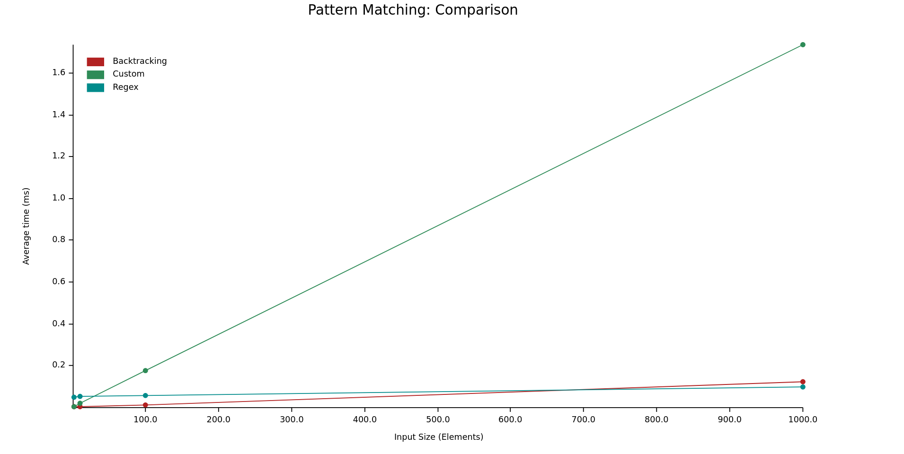

# Mighty Memory vs Crafty CPU. Choosing the right algo.

TL;DR Choosing an algorithm needs to consider more than just the time complexity. Avoid allocating memory on the hot path.

For a particular edit distance problem I worked on, Backtracking > Regex >> Dynamic Programming (DP). Shocker!!

---

Pattern matching is a critical step in a message bus. Every publish call has to match the given pattern with registered topics.

My patterns have the following rules.
* '*' - match 0 or more characters after this
* '?' - match any character once
* 'a-z' - match the specific character

Topics typically look like this - `data.quotes.BINANCE.ETHUSDT`. Which means a pattern like `data.quotes.*.*` will match the above topic but `data.quotes.*.*USDC` will fail.

Typically, topics are not expected to exceed 100 characters and a single pattern is likely match 1000 topics on the absolute extreme end. Each matched topic runs a handler. Too many handlers can introduce significant latency between processing data events.

We'll compare three implementations in this pattern matching context.

* [Dynamic Programming](https://en.wikipedia.org/wiki/Dynamic_programming) (DP) - The bane of leetcoders. The veritable god of algorithms. The saviour of O.
* [regex](https://crates.io/crates/regex) - The fastest rust regex library written by BurntSushi himself. My custom pattern can easily be converted to a valid regex pattern.
* [Backtracking](https://github.com/nautechsystems/nautilus_trader/blob/dabc0d2d96f0cc61d4f11bc801c3e72a4138882b/crates/common/src/msgbus/matching.rs#L31) - The simplest algorithm. Easy to get wrong but easier to understand. Typically considered bad because its worst case is worse than you can imagine.

Given a single random pattern and matching it with 10, 100 and 1000 topics. Guess who wins??

---

Turns out DP (Custom) loses hard because, for each match, it allocates a ~1KB chunk of memory for the comparison table. Allocating memory on the hot path is very costly. In fact, we can calculate that per match DP takes about 1.6 us.

Regex is an interesting case. Building the DFA automate is costly but then matching is super fast and cost is amortized over the long run.

And the winner 🏆 is the humble backtracking algorithm. You can see that it's faster than regex up to 700 matches. Backtracking is good because it doesn't allocate extra memory. It has good cache locality because both the topic and pattern can be loaded in memory and seeked through using two pointers.

Since pattern matching is on the hottest path - every single new piece of data triggers the pattern matching logic and even the small improvement here gives 2-3% faster runtime of the overall system.

So there you have it folks! Don't allocate memory on the hot path. Unless you can amortize that cost over long lived logic.
