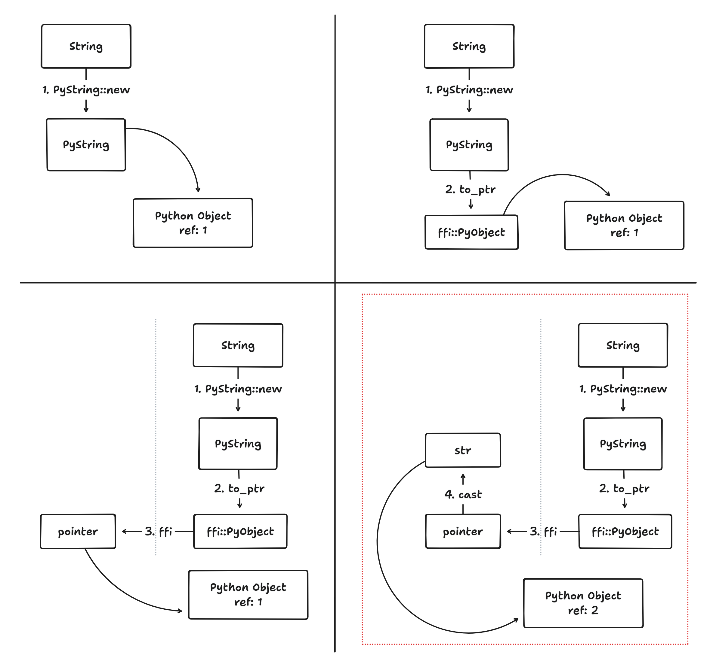

# Tales from Rust FFI - Python Pointer Panic 🦀 😱 🐍

In this post, we will discuss an subtle bug that leaked memory in Python. This is unusual since the Python language does not allow pointers directly and garbage collects any objects that are no longer needed. It demonstrates some of the challenges of working with FFI.

### Introduction

The nautilus engine[^0] is a backtesting and live trading engine. Backtesting typically simulates 5-10 years of market movements by passing GBs historical data through the trading engine. A user defined strategy then interacts with the simulated market by placing orders. While users typically write their strategies in Python, the performance intensive parts of the nautilus engine are written in Rust. The logic is exposed using a C interface which is wrapped using Cython so that it can be imported and used like a library in Python. Nautilus has been porting more and more of the core logic, originally written in Cython, to Rust over the past 2 years. It was mid-way through the porting journey that a bug report[^1] about a potential memory leak was filed...

### Verifying the memory leak

The report mentions that the allocated heap memory keeps on increasing with multiple backtests. Ideally, any memory allocated within a backtest should be deallocated after it is complete. However, after running the standard example backtest multiple times the heap allocated memory was steadily increasing. This observation was confirmed using memray (a memory profiling tool). Using valgrind showed a similar result. Interestingly, it mentioned about 8 MB of memory that was "still reachable" but no dangling pointers or definite loss (how?? 😱😱).

```
==90646== LEAK SUMMARY:
==90646==	definitely lost: 1,864 bytes in 15 blocks
==90646==	indirectly lost: 0 bytes in 0 blocks
==90646==  	possibly lost: 216,122 bytes in 213 blocks
==90646==	still reachable: 8,479,670 bytes in 11,220 blocks
==90646==                   	of which reachable via heuristic:
==90646==                     	stdstring      	: 19,554 bytes in 544 blocks
==90646==     	suppressed: 0 bytes in 0 blocks
==90646==
``` 

This is unexpected in Python because any reachable memory should be deallocated during garbage collection. Which means that references to some objects were still being held on after a run. Serious eyeballing the code did not show any references being held or global state being modified during runs.

<details><summary>More trivia 🤓</summary>
A big challenge was the uncertainty around the where and when the leak was introduced. There was no  profiling memory until then. So after extensive git bisecting it was revealed that this commit[^2] which implemented the first rust core, about 600 commits from the HEAD, had introduced the bug.
</details>

## Root Cause Analysis (RCA)

Nautilus is a complex code base because it has three layers, Python, Cython and Rust. Parts of Cython are being ported to Rust, but they still have to co-exist for now. The most difficult part was isolating the bug from this complexity and reproducing it using a minimal example. Not only to understand it better, but also because the large build times on the full codebase made iteration very slow. There were some hints from the valgrind summary that the leak was possibly related to strings. After much experimentation and helpful discussion[^5], the bug was narrowed down to the minimum reproducible example[^3] explained below.

This `Data` struct stores a heap allocated string. However, since our main control flow is in Python we want its string representation to be available to Python/Cython code for printing or other logic. We are using the PyO3 library interface between Python and Rust. It can create fully owned Python String objects. However, to expose it to the Cython layer, we needed to pass a type that’s FFI compatible, in this case it’s a raw pointer to a Python object.

```Rust
struct Data {
  value: String
}

#[no_mangle]
pub unsafe extern "C" fn data_to_pystr(data: &Data) -> *mut ffi::PyObject {
    let s = data.value.as_str();
	Python::with_gil(|py| {
        // Create a Python string object from the given string
        let pystr: Py<PyString> = PyString::new(py, s).into();
        // Return an FFI compatible pointer to the object
        pystr.into_ptr()
    })
}
```
> data.rs

The `Data` struct gets exported to C as wrapped into a Cython class and exposes a similar `to_str` method to return its string representation. It takes the underlying Rust Data struct and gets back a raw pointer to the Python string and typecast it into a full Python string object.

```Cython
cdef class Data:
    cdef Data_t  _mem

    cdef str to_str(self):
        return <str>data_to_pystr(&self._mem)
```
> data.pyx

BUTTT!! There’s a subtle bug here 🐛 🤯. Do you see it?? It’s this line `<str>data_to_pystr(&self._mem)`.

The Rust function `data_to_pystr` creates a Python string object and converts it into a pointer. The reference count for that object is 1. This is needed because a valid object’s reference count should never be 0, as it can get garbage collected. For a similar reason, when Cython typecasts a raw pointer to an object it increments the reference count by one. Because a valid object should have reference count 1, and there are no guarantees about the reference count of a raw pointer. So after the offending line the reference count for the Python string object is 2, even though there is only one actual reference to it!! When the reference goes out of scope the reference count is decremented from 2 to 1. The GC cannot collect the memory thus leaking it.


> A Python object with 1 reference but 2 ref count

It’s a very subtle bug. An excellent example of complexity arising at the interface of two systems a.k.a integration hell. Although it could have been prevented by carefully reading the documentation[^4] 😭.

> You can also cast a C pointer back to a Python object reference with cast(object, ...), or to a more specific builtin or extension type (e.g. cast(MyExtType, ptr)). This will increase the reference count of the object by one, i.e. the cast returns an owned reference.

### Fix and validation

And, the fix was to simply add an explicitly reference count decrement after type casting it. Or to type cast it as a pointer.

```Cython
cdef inline str pyobj_to_str(PyObject* ptr):
	cdef PyObject* str_obj = ptr
	cdef str str_value = <str> str_obj
	Py_XDECREF(str_obj)
	return str_value
```

The difference was clear. Here’s the difference in memory before and after a run taken using tracemalloc. You can see that before the fix, around 4 MB of memory is still accessible after a full run. After the fix, only a few bytes of memory probably from the runtime and global objects is remaining.

```
[ Top 10 differences ]
Nautech Systems/nautilus_experiments/tests/test_objects.py:43: size=4150 KiB (+4150 KiB), count=50000 (+50000), average=85 B
Nautech Systems/nautilus_experiments/tests/test_objects.py:63: size=706 B (+706 B), count=8 (+8),
— omitted
```
> before fix

```
[ Top 10 differences ]
Nautech Systems/nautilus_experiments/tests/test_objects.py:63: size=706 B (+706 B), count=8 (+8), average=88 B
.pyenv/versions/3.9.16/lib/python3.9/tracemalloc.py:423: size=88 B (+88 B), count=2 (+2), average=44 B
— omitted
```
> after fix

[^0]: https://github.com/nautechsystems/nautilus_trader/
[^1]: https://github.com/nautechsystems/nautilus_trader/issues/880
[^2]: https://github.com/nautechsystems/nautilus_trader/commit/398116c91333e1933f865b1d4a1d9b9e6e8458e9
[^3]: https://github.com/nautechsystems/nautilus_experiments/tree/4babdb7ce44a409876e0b5a134a3c9c3129543f4
[^4]: https://cython.readthedocs.io/en/latest/src/userguide/language_basics.html#type-casting
[^5]: https://github.com/PyO3/pyo3/discussions/2804
