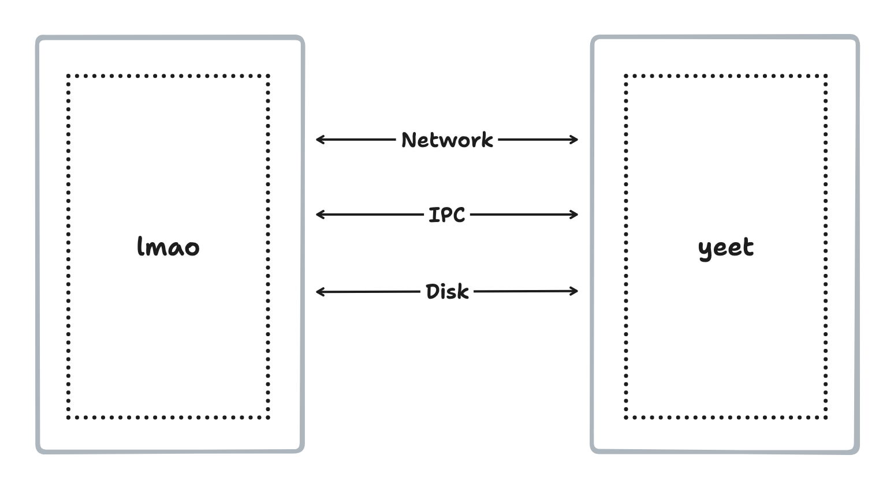
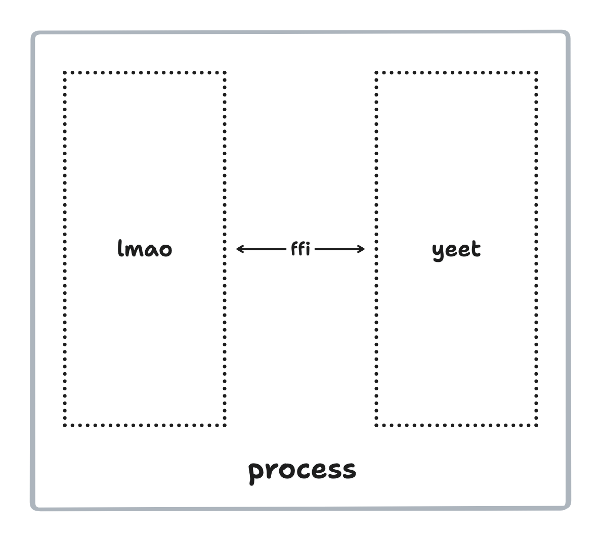
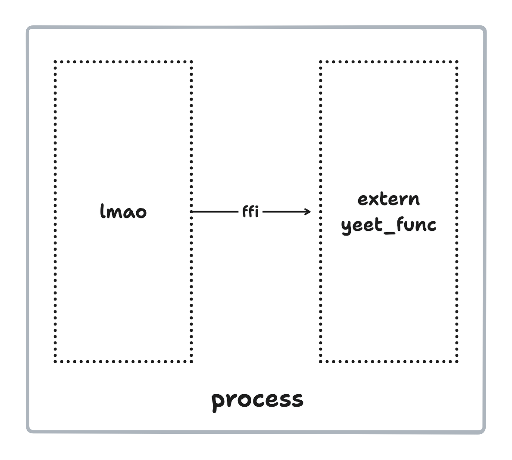
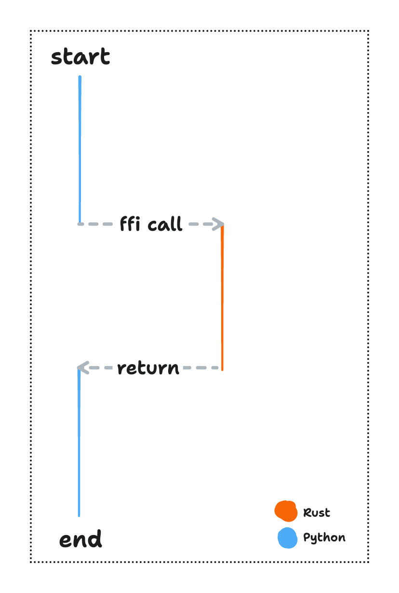
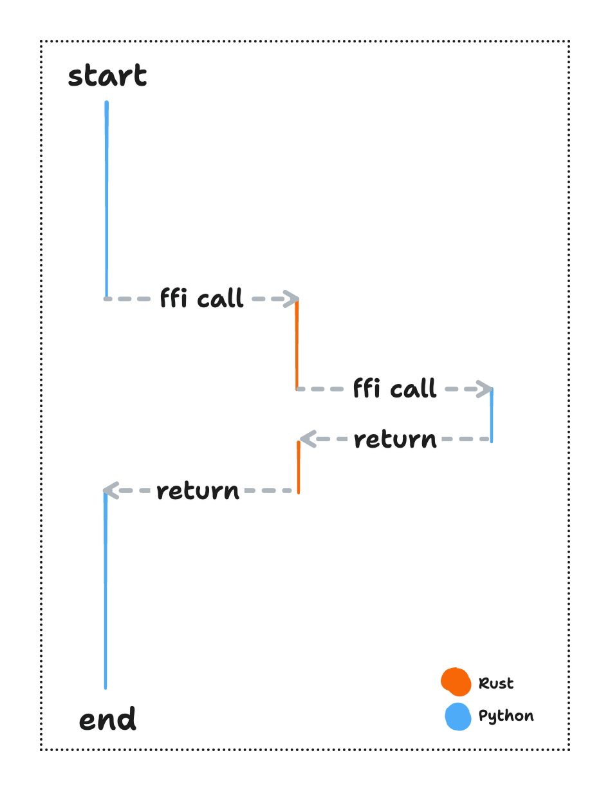
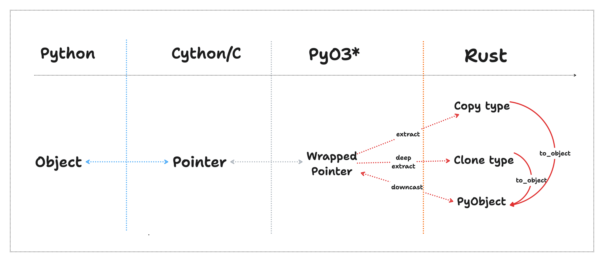
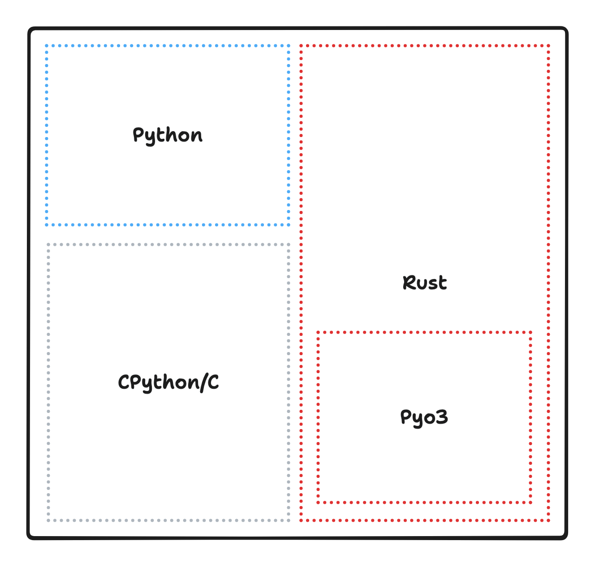
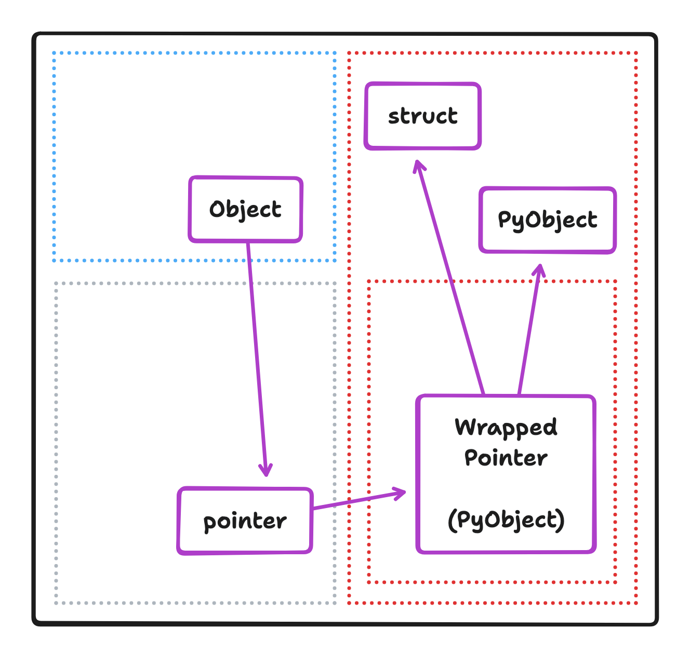
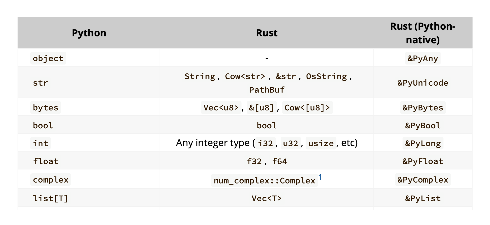
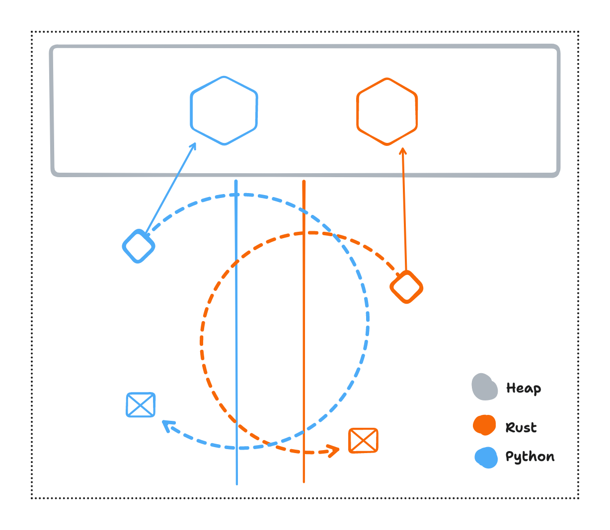

# Tales from Rust FFI - Building in Rust for Python 🦀 ❤️ 🐍

We will cover the following -
* What is FFI?
* How does FFI work?
* A working example
* When to FFI?

### What

Usually when we think of two languages interacting with each other, it is by exchanging data or inter-operating through a well defined API. It could be a network protocol or through files on the disk. A case where the two actively running programs need to communicate on the same machine could be through inter-process communication like shared memory buffers, or message passing queues.



* A mobile app written in Java connects to a rust web server through network APIs
* A telemetry service implemented in go scrapes data from the server through shared memory buffers (IPC)
* The server logic is written in a VS Code editor which is an electron app. The logic gets saved in files and then compiled by the rust compiler. Thus the file system is being used interface between the editor and the compiler.

All these are examples where the logic written in two languages are running in two difference process. However when two languages inter-operate using FFI they operate **within the same process**.



FFI or Foreign Function Interface. Allows two different languages to inter-operate withing the same process by exchanging data and calling functions. `extern` keyword in C introduces the concept of data or function that is "external" to the program. Similarly rust has `extern "C" fn` which says the function can be called from outside the rust program. Here the "C" indicates that the function should be called as if it were a "C" function[^1]. It indicates how the function arguments and return value should be set up in the stack frame.



There are many real world applications/platforms that have inter-op at their core. To name a few -
* WASM runs in the browser by interfacing with JS
* Writing android mobile app using Rust on mobile using JNI
* LLVM compiler written in C++ has bindings for Rust
* and many more ...

<details><summary>More trivia 🤓</summary>

`extern` defines a function interface that is called from outside the current
program boundary/compilation unit. Before an extern function can be called
the program needs to make sure that it actually exists. This done during the
linking process[^4].

Static linking - This is done before executing the program. The extern function
implementation is packaged along with the rest of the logic.

Dynamic linking - The bundle containing the extern function implementation is loaded[^3]
while the program is being run.

</details>

### How

There are 4 key points that make FFI possible

* Control Flow
* Data transfer
* Data layout
* Memory management

#### Control Flow

When two languages interop, they are not equal. One of the languages is the host language the other is a guest language. Normal program execution starts with the host and ends with the host. In between the guest and the host can freely call extern/exposed functions in each other's logic.



In general a higher level language is used as the host language and the guest language is a lower level language which is used to handle some specific use case or functionality which is best suited to it.



Think of the host language as the one that defines the `main` entry point to the program.

#### Data transfer

The biggest challenge for interoping two languages is to transfer data. In Python everything is an object. For Rust every struct is a efficiently packed continiuous block of memory [^5] either allocated on the stack or the heap. Python and Rust need a common ground, a common language they both speak.

It turns out there is such a thing. The core of CPython is written in C and Rust does speak C using extern functions. In fact it can also represent structs in a way C can understand it by using `#[repr(C)]`[^7]. We can use C as the underlying medium to transfer data as blocks of memory or pointers.



We can use this to systematically transfer data between Python and Rust. Everything in Python is an object. Inside the object there is something like a pointer to a heap allocated block of memory, the pointer is passed to Rust through an extern function. But we need more metadata to properly use all the properties of Python objects this of course is hidden somewhere in the block of memory. Pyo3 is a Rust library[^2] that extracts all this information and wraps into a neat mostly safe interface. It, of course, relies on a bunch of low level unsafe stuff that manually infers information from the Python object format.

Pyo3 creates a generic `PyObject` struct that represents any python object and necessary metadata around it. We can directly `extract` `Copy` types from it. For `Clone` types, we need to do a deep `extract`. For e.g. a List of integers can only be converted to a `Vec<usize>` by traversing the list and extracting the integers one by one and pushing them into a `Vec`.



High level code can be written in both Python and Rust. Both have an lower level inner layer which is C/Cython and unsafe Rust respectively. Pyo3 writes the unsafe logic that interfaces with C layer and gives us, the library user, a clean interface to access the Python data.



#### Data layout

Python has a very liberal data model. For e.g. a Python list can store an int and a string and any other object. Standard Rust data types can't represent this at all. In such cases, Pyo3 gives us a generic wrapped pointer known as a `PyAny`. It's the most general python type reprsenting any `object`. The compiler cannot make any guarantees about the properties of the object.


> https://pyo3.rs/v0.11.1/conversions.html

<details><summary>More trivia 🤓</summary>
ABI - Application Binary Interface is the internal/memory level data representation for objects/structs in a language. To interoperate and pass data to each other, two langauges need to agree on the data layout. Pyo3 does this for us by traversing and understanding Python object and extracting relevant data for us. However this relies on Python ensuring that it's internal data representation stays the same. This is why ABI stability is considered important for languages that need to interoperate with others.
</details>

#### Memory life cycle

There is one rule regarding memory allocation that both languages need to follow. A block of memory should only be deallocated by the language that allocated it. If this rule is violated, it might cause memory leaks or dangling pointers. 

In the case of Python everything is allocated on the heap and reference counted. Any object transferred to rust needs to increment it's reference count and decrement it when it is dropped. Python can garbage collect the object once the reference count is 0.

For Rust `Copy` types can direclty be transformed into Python objects. `Clone` types i.e heap allocated structs can be transferred into two ways -
* Traverse the struct and transform it into an appropriate Python object
* Leak the memory and pass it to C/Cython as a pointer. By leaking it, we are telling the compiler that it need not manage the memory anymore. It shouldn't deallocate the memory even when it is no longer in scope. Now the programmer is responsible for leaking the memory and deallocating it properly. The compiler does not drop the contents of the pointer once it leaves the scope of the function. But the pointer needs be returned to Rust and properly deallocated otherwise it will leak memory.

For e.g. we can leak a `Box<T>` and pass the data to C/Cython and then receive it back.

```Rust
#[repr(C)]
struct Person {
    height: u32,
    age: u32,
}

extern "C" fn leak_person_data(data: Box<Person>) -> *mut Person {
    Box::leak(data) as *mut Person
}

extern "C" fn receive_person_data(ptr: *mut Person) -> Box<Person> {
    unsafe { Box::from_raw(ptr) }
}
```



We can see how PyO3 does things internally. It uses `ManuallyDrop` and `UnsafeCell` to store the struct on the heap, while retaining full control of the memory and when it is deallocated.

```Rust
PyCellContents {
    value: ManuallyDrop::new(UnsafeCell::new(self.init)),
    ...
}
...

    let initializer: _pyo3::PyClassInitializer<Logger> = result.convert(_py)?;
    let cell = initializer.create_cell_from_subtype(_py, subtype)?;
    ::std::result::Result::Ok(cell as *mut _pyo3::ffi::PyObject)
```

<details><summary>More trivia 🤓</summary>
This rule is needed because most languages have internal book keeping for memory. This is called the memory allocator which requests memory from the OS and then gives out portions of it to the application logic as required.[^8]

This means that any memory allocated in Rust is noted down in the Rust memory allocator. If this memory is freed by Python, then Rust's memory allocator will not know that it's entry is now invalid.

However there might be unique cases where both the language are share the same memory allocator. In this case memory can be freely allocated and deallocated on either side.
</details>

### Working example

We'll create a minimalistic logger in Rust and call it from Python. This is the directory structure for the project. We only need one dependency `pyo3 = { version = "0.19.0", features = ["extension-module"] }`.

```
.
├── Cargo.toml
├── hello_mic_testing.py
└── src
    └── lib.rs
```

We create a logger struct that holds a buffered writer to stdout. It also stores
a reference to a Python object to callback if the logged string contains an "ERROR"
substring.

The `#[pyclass]` macro wraps the `Logger` into a an implementation that can
be passed to Python as an object.

```Rust
use std::io::{self, BufWriter, Stdout, Write};

use pyo3::prelude::*;
use pyo3::types::PyUnicode;

#[pyclass]
struct Logger {
    out: BufWriter<Stdout>,
    callback: Option<PyObject>,
}
```

We define methods for `Logger` methods for creating a logger and logging a string. Notice that we receive a `PyObject` as argument in `new` and `log`.

In `log` we downcast and extract a string from it. If the passed object is not a string the logic will panic. Furthermore, if the string contains an "ERROR" we call the python object. If the object cannot be called the `call0` will panic.

Also notice the `Python::with_gil`. Python objects can be passed around freely but to downcast, call or interact with them in anyway, we need to acquire the GIL. Pyo3 gives us a convenient interface to do this.

We also need the `#[pymethods]` macro so that pyo3 can package these methods as methods on the python class for logger. Then these methods can be called directly from Python.

```Rust
#[pymethods]
impl Logger {
    #[new]
    fn new(callback: Option<PyObject>) -> Self {
        tracing::info!("Create logger");
        let out = BufWriter::new(io::stdout());
        Self { out, callback }
    }

    fn log(mut slf: PyRefMut<'_, Self>, msg: PyObject) {
        Python::with_gil(|py| {
            let msg_str = msg.downcast::<PyUnicode>(py).unwrap();
            let log_str = msg_str.to_str().unwrap();

            slf.out.write_all(log_str.as_bytes()).unwrap();

            if let Some(ref callback) = slf.callback {
                if log_str.contains("ERROR") {
                    callback.call0(py).unwrap();
                }
            }
        });
    }
}
```

Pyo3 also makes sure that when the Python object for logger is garbage collected, the `drop` function is called for the underlying `Logger` struct. Hooking into it we can flush the log so that any pending messages are not lost.

```Rust
impl Drop for Logger {
    fn drop(&mut self) {
        self.out.flush().unwrap();
        eprintln!("Rust: Flushed and closed logger");
    }
}
```

Finally we can add the class to a python module. The `#[pymodule]` macro does the heavy lifting of filling in the rest of the details needed to package this into a Python module. Note: that the name of this function must be the same as the name of the crate specified in `Cargo.toml`.

```Rust
#[pymodule]
pub fn tales_from_ffi(_: Python<'_>, m: &PyModule) -> PyResult<()> {
    m.add_class::<Logger>()?;
    Ok(())
}
```

Finally we can compile this rust code and build a python wheel from it by running `maturin develop`[^6]. You need maturin installed with `pip install maturin` to run this.

Now we can import this module and use the logger in Python. We implement a callback function that sends an error notification when the global count for "ERROR" messages becomes 2. Notice that this function can be passed and called from Rust.

```Python
from tales_from_ffi import Logger

count = 0

def error_notif():
    global count
    count += 1
    print("Failure logged")
    if count == 2:
        raise Exception("Failed too many times")
    
def test():
    logger = Logger(error_notif)
    logger.log("hello\n")
    logger.log("world\n")
    logger.log("[ERROR] gone wrong\n")
    logger.log("[ERROR] gone wrong\n")

if __name__ == "__main__":
    test()
```

### When to FFI

FFI adds significant complexity to a codebase and should be considered carefully before adopting. Some questions to ask are -
* Is it technically possible to inter-operate two given languages?
* Is the tooling robust enough to ensure a good developer experience?
* Does it fit the context of the project?

The last point, perhaps, is the most subtle. I contribute to the [nautilus project](https://github.com/nautechsystems/nautilus_trader/) that has had great success in inter-operating Python and Rust because it fit the context well.

For e.g. in practice this [logger](https://github.com/nautechsystems/nautilus_trader/blob/master/nautilus_core/common/src/logging.rs) is interfaced with [Cython](https://github.com/nautechsystems/nautilus_trader/blob/master/nautilus_trader/common/logging.pyx). It can take a pointer to a string and log it, thus avoiding acquiring the GIL for logging.

Apart from the obvious performance and correctness benefits, a significant gain was in maintainer momentum. For an open-source project with 3-4 maintainers burnout/dropout rate is a real concern. With implementations that just work, the maintainers can work on implementing other important features rather than doing piecemeal performance tuning or chasing trivial bugs.

### For another time

We covered the rules for inter-operating between two languages, where we specifically focused on Python and Rust. Knowing the rules also tells what language features cannot work directly and need workarounds. These are some of the more advanced patterns we will cover in a future post.

* Rust Generics
* Accessing Python objects in Rust
* Running async Rust from Python
* Interfacing Rust and Cython

---

Read the next Rust FFI tale - [Python Pointer Panic](./tales-from-ffi-python-pointer-panic.md)

---

_The ideas in this post were originally [presented](https://docs.google.com/presentation/d/1Ww5mVbfU0FYbK1DWA6JE6zwVgzB5gw3zaNzk_HaH6xI/edit?usp=sharing) at the [Rust India July Meetup](https://hasgeek.com/rustlangin/july-2023-rustacean-meetup/)._

[^1]: https://doc.rust-lang.org/nomicon/ffi.html#foreign-function-interface
[^2]: https://pyo3.rs/
[^3]: https://man7.org/linux/man-pages/man3/dlopen.3.html
[^4]: https://cs-fundamentals.com/tech-interview/c/difference-between-static-and-dynamic-linking
[^5]: https://www.eventhelix.com/rust/rust-to-assembly-arrays-option-box/
[^6]: https://github.com/PyO3/maturin
[^7]: https://doc.rust-lang.org/nomicon/other-reprs.html
[^8]: https://www.gnu.org/software/libc/manual/html_node/The-GNU-Allocator.html
