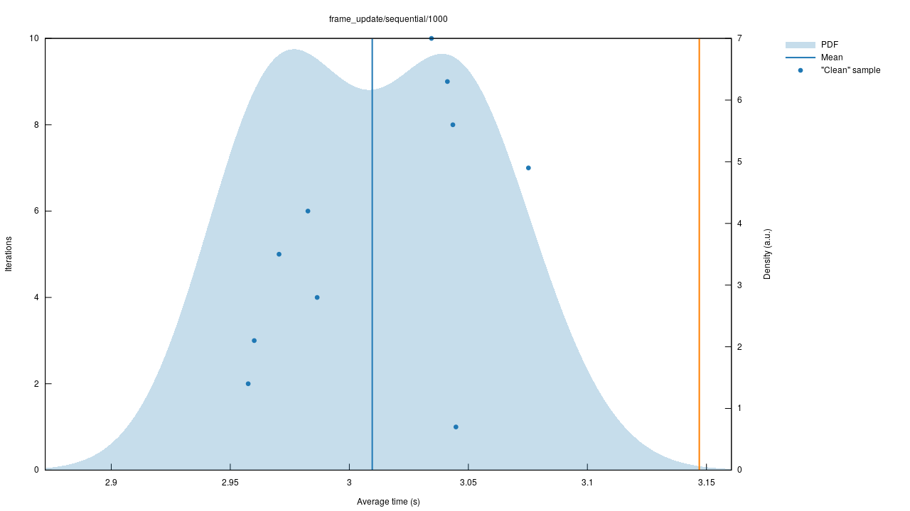

# The school, the boid and the Rusty - boids in Rust (Part 3)


Hi. In the [previous part](./for-a-few-boids-more.md), we harnessed randomness to generate boids and added a rule for obstacle avoidance. We'll be completing our experiment in this part by covering the following:

1.  Adding rules for flock behaviour
2.  Using parallelism to boost performance
3.  Bench-marking performance

You can download the project at this point from this [tagged version](https://github.com/twitu/rboids/tree/stage_5).

* * *

## Breathing life

Life in a flock consists of three simple rules as mentioned in the [original paper](http://www.cs.toronto.edu/~dt/siggraph97-course/cwr87/).

1.  Collision Avoidance: avoid collisions with nearby flockmates
2.  Velocity Matching: attempt to match velocity with nearby flockmates
3.  Flock Centering: attempt to stay close to nearby flockmates

These rules together with obstacle avoidance governs how each boid moves relative to it's neighbours. **In this section, we will integrate flocking rules into our simulation.** At the end of it you will have something like this.


> Swirling patterns of boids in flight

### Refactor for discipline

Currently, the `frame_update` directly changes the velocity of the boid if it encounters an obstacle. Here's the code snippet.

```rust
            // check if current heading is obstructed
            let cur_ray: Ray<f32> = Ray{origin: self.pos, dir: self.vel.normalize()};
            if collided(obs, cur_ray) {
                // try to find an unobstructed direction
                // only affect acceleration if unobstructed direction exists
                if let Some(dir) = self.unobstructed_dir(obs) {
                    self.vel = dir * self.vel.magnitude();
                }
            }
```

> change velocity in `frame_update`

This won't work when there are multiple rules. So we'll introduce the concept the of acceleration.

1.  Each rule has a constant weightage.
2.  Each rule's contribution to the new velocity is directly proportional to its weight.
3.  The difference between current and new velocity is the acceleration.
4.  The magnitude of acceleration has an upper limit.
5.  The clamped acceleration changes the current velocity.

To integrate this concept into our boid model, we'll have to do some refactoring. Let's start by creating the `calc_acc` method and few constant values.

```rust
    use ncollide3d::nalgebra::clamp;
    
    // rule weightage
    const MAX_ACC: f32 = 3.0;
    const MIN_ACC: f32 = 0.0;
    const OBSTACLE_W: f32 = 6.0;
    
    impl Boid {
    	--- clipped ---
        
        /// calculate clamped acceleration
        fn calc_acc(&self, vel: &Vector3<f32>) -> Vector3<f32> {
            let mut acc = vel.normalize() * MAX_VEL - self.vel;
            acc.set_magnitude(clamp(acc.magnitude(), MIN_ACC, MAX_ACC));
            acc
        }
    }
```

> `calc_acc` method

This second parameter of this method `vel` is the ideal velocity of the boid calculated by applying a rule. The acceleration is the difference between current velocity and maximum velocity along the ideal direction. A clamped value of acceleration is returned.

```rust
    impl Boid {
    	--- clipped ---
        
    	/// apply rules to calculate acceleration
        fn apply_rules(&self, obs: &Vec<(Box<dyn RayCast<f32>>, Isometry<f32>)>) -> Vector3<f32> {
            let mut acc: Vector3<f32> = Vector3::new(0.0, 0.0, 0.0);
    
            // check if current heading is obstructed
            let cur_ray: Ray<f32> = Ray{origin: self.pos, dir: self.vel.normalize()};
            if collided(obs, cur_ray) {
                // try to find an unobstructed direction
                // only affect acceleration if unobstructed direction exists
                if let Some(dir) = self.unobstructed_dir(obs) {
                    acc += self.calc_acc(&dir) * OBSTACLE_W;
                }
            }
    
            acc
        }
    }
```

> Obstacle avoidance logic moved to `apply_rules`

Next we move the obstacle avoidance logic to `apply_rules` method. The only difference is in `acc += self.calc_acc(&dir) * OBSTACLE_W;`. Instead of directly changing velocity, we add a proportional amount to the total acceleration.

```rust
    impl Boid {
    	--- clipped ---
        
        pub fn frame_update(&mut self, obs: &Vec<(Box<dyn RayCast<f32>>, Isometry<f32>)>, delta_time: f32) {
            // update position
            self.pos += self.vel * delta_time * TIME_SCALE;
    
            // update velocity
            let mut new_vel = self.vel + self.apply_rules(obs);
            new_vel.set_magnitude(clamp(new_vel.magnitude(), MIN_VEL, MAX_VEL));
            self.vel = new_vel;
        }
    }
```

> Calculate new velocity using acceleration

Then we modify `frame_update` to use the acceleration value from `apply_rules` to calculate the new velocity. This was only refactoring and it should not have any effect on the behaviour.


> 50 boids bouncing around

For this animation, I changed `SPAWN_NUMBER` to 50 in `main.rs` and ran `cargo run --release`. A release build is highly optimized and performs much better.

[tagged version](https://github.com/twitu/rboids/tree/stage_6)

### Rules make a flock

To use neighbour information, we'll have to pass some extra parameters to `frame_update`. Most importantly we need the list of boids.

```rust
        // render scene
        while win.update() && !win.input.hit(three::KEY_ESCAPE) {
            // update camera transform
            controls.update(&win.input);
    
            // Clone current boids information
            let copy: Vec<Boid> = boids.clone();
    
            // compute new boxy velocity and set it
            boids.iter_mut().enumerate().for_each(|(i, b)| b.frame_update(i, &copy, &obstacles, win.input.delta_time()));
            boids.iter().zip(cones.iter()).for_each(|(b, c)| c.set_transform(b.pos_array(), b.rot_array(), 1.0));
    
            // render scene
            win.render(&cam);
        }
```

> Pass extra information to `frame_update`

We pass a clone of all the boids and the index number of the boid calling the `frame_update` method. Here, `clone` performs a [deep copy](https://stackoverflow.com/questions/184710/what-is-the-difference-between-a-deep-copy-and-a-shallow-copy) since we have derived the `Clone` attribute for struct `Boid`. This is essential, because Rust will not allow passing `&boids` to `frame_update`. Its rules do not allow creating an immutable reference, when a mutable reference has already been borrowed by `iter_mut`. Logically, it makes sense. If we change the contents of the list while using it for calculations, we will get unpredictable results.

To accommodate this change, method type signatures must be changed in `boid.rs`.

```rust
        pub fn frame_update(
            &mut self,
            i: usize,
            copy: &Vec<Boid>,
            obs: &Vec<(Box<dyn RayCast<f32>>, Isometry<f32>)>,
            delta_time: f32,
        ) {
        	--- clipped ---
    
            let mut new_vel = self.vel + self.apply_rules(i, copy, obs);
    
    	--- clipped ---
        }
        
        /// apply rules to calculate acceleration
        fn apply_rules(
            &self,
            i: usize,
            copy: &Vec<Boid>,
            obs: &Vec<(Box<dyn RayCast<f32>>, Isometry<f32>)>,
        ) -> Vector3<f32> {
        	--- next section ---
        }
```

> Pass extra parameters to `apply_rules`

The functions are much more readable because each parameter has been formatted to a single line by `rustfmt`. It is the default Rust code formatter and applies formatting rules uniformly across most open source projects.

Let's aggregate neighbour information. Define the following constants at the top of `boid.rs`.

```rust
    // scaling factors
    const TIME_SCALE: f32 = 1.0;
    const MAX_VEL: f32 = 14.0;
    const MIN_VEL: f32 = 7.0;
    const RAY_NUMS: usize = 100;
    const MAX_ACC: f32 = 2.0;
    const MIN_ACC: f32 = 0.0;
    
    // rule weightage
    const OBSTACLE_W: f32 = 6.0;
    const ALIGN_W: f32 = 0.2;
    const COLLISION_W: f32 = 1.0;
    const COHESION_W: f32 = 0.1;
    
    // limits
    const OBSTACLE_DIST: f32 = 5.0;
    const VIEW_ANG: f32 = 2.0 * std::f32::consts::FRAC_PI_3; // 120 degrees in radians
    const VIEW_R: f32 = 3.0;
    const COLLISION_R: f32 = 1.3;
```

> Constant values in `boid.rs`

There are three types of constants:

1.  Scaling factors most of which we have defined earlier.
2.  Rule weightage defines the contribution of each rule to the final acceleration.
3.  In limits, `VIEW_ANG` is 120 degrees, indicating the range of vision for a boid. `VIEW_R` is the radius of the sphere inside which neighbours can be detected. `COLLISION_R` is the radius inside which a boid tries to avoid collision with other boids.

To implement rules in `apply_rules` method, we need to create accumulators for neighbour information.

```rust
        /// apply rules to calculate acceleration
        fn apply_rules(
            &self,
            i: usize,
            copy: &Vec<Boid>,
            obs: &Vec<(Box<dyn RayCast<f32>>, Isometry<f32>)>,
        ) -> Vector3<f32> {
            let mut acc: Vector3<f32> = Vector3::new(0.0, 0.0, 0.0);
    
            // intialize accumulators
            let mut neighbours: i32 = 0;
            let mut too_near: i32 = 0;
            let mut alignment: Vector3<f32> = Vector3::new(0.0, 0.0, 0.0);
            let mut cohesion: Vector3<f32> = Vector3::new(0.0, 0.0, 0.0);
            let mut collision: Vector3<f32> = Vector3::new(0.0, 0.0, 0.0);
    
    	 	--- next section ---
        }
```

> Initialize accumulators

There are 3 accumulators for each flock rule and 2 counters for how many neighbours have matched certain conditions.

```rust
    
        /// apply rules to calculate acceleration
        fn apply_rules(
            &self,
            i: usize,
            copy: &Vec<Boid>,
            obs: &Vec<(Box<dyn RayCast<f32>>, Isometry<f32>)>,
        ) -> Vector3<f32> {
        
        	--- clipped ---
    
            // aggregate neighbour information
            for (index, b) in copy.iter().enumerate() {
                // ignore self
                if index == i {
                    continue;
                }
    
                // only look within viewing angle
                let separation = b.pos.coords - self.pos.coords;
                if b.vel.angle(&separation) >= VIEW_ANG {
                    continue;
                }
    
                // only look within viewing radius
                if separation.magnitude() >= VIEW_R {
                    continue;
                }
    
                // update accumulators
                neighbours += 1;
                alignment += b.vel;
                cohesion += b.pos.coords;
                if separation.magnitude() < COLLISION_R {
                    too_near += 1;
                    collision -= separation / separation.magnitude();
                }
            }
            
            --- next section ---
        }
```

> Filter for neighbours

The logic is to filter for boids that match the following criteria:

1.  It's not the one calling this method. We do this by comparing the index.
2.  It is within the viewing angle. We've defined viewing angle to 120 degrees in any direction from the velocity.
3.  It is within the viewing radius of `self`.

With these we aggregate the following data:

1.  `neighbours` simply contains the number of boids that satisfied the above conditions.
2.  `alignment` sums up velocities.
3.  `cohesion` combined the position of neighbours.
4.  `collision` adds vectors in the opposite direction to neighbours that are too close. The closer the neighbou the larger the repulsion. `too_near` counts how many neighbours matched this condition.

We use the aggregated data to create an acceleration that affects the boid.

```rust
        /// apply rules to calculate acceleration
        fn apply_rules(
            &self,
            i: usize,
            copy: &Vec<Boid>,
            obs: &Vec<(Box<dyn RayCast<f32>>, Isometry<f32>)>,
        ) -> Vector3<f32> {
        
        	--- clipped ---
    
            if neighbours != 0 {
                alignment = alignment / neighbours as f32;
                cohesion = (cohesion / neighbours as f32) - self.pos.coords;
    
                acc += self.calc_acc(&alignment) * ALIGN_W;
                acc += self.calc_acc(&cohesion) * COHESION_W;
            }
    
            if too_near != 0 {
                acc += self.calc_acc(&collision) * COLLISION_W;
            }
    
    		--- clipped obstacle avoidance logic ---
    
            acc
        }
```

> Calculate acceleration

A rule that has no valid neighbours should not contribute to acceleration. That is why we'll perform a few checks before applying the rules.

1.  `alignment` and `cohesion` are only applied if there is at least one valid neighbour.
2.  `alignment` is applied in the direction of average velocity of all valid neighbours.
3.  `cohesion` is calculated as the direction toward the average position (center of mass) of all valid neighbours.
4.  Similarly, `collision` is applied only when there is at least one boid that is too close. It applies an acceleration towards the direction of repulsion.

`cargo run --release` and be awed by the magic.


> Swirling patterns of boids in flight

If you don't get something like this, you'll have to tweak the constant values and weights. These are some general observations.

1.  Increasing `MAX_VEL` and `MIN_VEL` is a helpful step. It keeps the flock from collapsing on itself due to cohesive forces.
2.  Low `COHESION_W` and `ALIGN_W` is good. It keeps the flock from becoming too uniform.
3.  Increasing `MAX_ACC` can make the boids jittery because a large acceleration causes sudden changes in velocity.

[tagged version](https://github.com/twitu/rboids/tree/stage_7)

* * *

## Mark the bench

Our experiment has achieved its goal but it's not yet complete. Rust is known for performance and hence, it is our duty to **benchmark the performance of `frame_update`**.

We'll use the [criterion](https://bheisler.github.io/criterion.rs/book/criterion_rs.html) crate for performance benchmarking. I won't be detailing every change needed to make this run, mostly because it involves a non-trivial amount of refactoring. You can directly download the [tagged version](https://github.com/twitu/rboids/tree/stage_8). The major changes are given below.

1.  Till now, we treated rboids as a binary/executable project but `criterion` requires `rboids` to be a library type project. To make this change, I added a `lib.rs` file that exports `pub mod boid;`. There is no need to modify `main.rs`. A library type project can still have a `main` function for executing code.
2.  Move `create_obstacles` to `boid.rs` for convenience. Since `criterion` treats the project like a library, we cannot use any function from `main.rs`.
3.  Add benching related dependencies and configuration to `Cargo.toml`.
4.  Create a benchmark for sampling `frame_update` with different number of boids.

The benchmark runs for 10, 50, 100, 200, 500, 1000 number of boids. It samples 10 times for each value and each sample runs 100 frames. The benchmark ignores the cost of rendering the scene and assumes a constant `delta_time` of 0.02 seconds.

`cargo bench` runs the benchmark and generates the data for the graphs shown below. `gnuplot` is an external dependency necessary for generating these graphs.




> r/dataisbeautiful

The line graph shows that time complexity is roughly quadratic to the number of boids. Logically too, this makes sense, since each boid iterates over all other boids to compute aggregate neighbour information.

Other graphs show the variation in run time for different samples. `frame_update/1000` is the graph for the run with 1000 boids. At an average of 3.05 seconds for 100 frames, it comes out to about 33 frames fps. This does not match up to the 60 fps milestone we want to achieve.

* * *

## Adding parallelism

Interestingly, this is the smallest section of this entire series. Rust has forced us to design our program a way that makes parallelism trivial. We'll use the `[rayon](https://docs.rs/rayon/1.3.0/rayon/index.html)` crate. Add `rayon = "1.3.0"` to dependencies.

We only need to **parallelize the operation of calling `frame_update`**. This is computationally the most heavy method and the only one whose implementation we can control. Since the method itself takes no mutable references, there is no possibility of data races or deadlock situations of any kind. To do this, we convert the mutable iterator to a parallel mutable iterator by using `par_iter_mut`.

```rust
    use rayon::prelude::*;
    
    fn main.rs() {
    	--- clipped ---
        
        // render scene
        while win.update() && !win.input.hit(three::KEY_ESCAPE) {
    
            // compute new boxy velocity and set it
            boids
                .par_iter_mut()  // from iter_mut
                .enumerate()
                .for_each(|(i, b): (usize, &mut Boid)| b.frame_update(i, &copy, &obstacles, win.input.delta_time()));
            boids
        }
    }
```

> Change `iter_mut` to `par_iter_mut` for iterating over boids

However, compiling it will throw an error. The key message is this.

```rust
std::marker::Sync is not implemented for dyn ncollide3d::query::ray::ray::RayCast<f32>
```

The compiler is telling us that something cannot be shared across threads because it does not implement `Sync`. We are using `dyn RayCast<f32>` to defined the type obstacle shapes.  Let's check documentation for one of the shapes.


> struct `Cylinder` implements `Sync`

All the shapes we are using implement `Sync` as part of Auto Trait. We need to explicitly tell the compiler that these shapes can be shared across threads. Change the type to `Box<dyn RayCast<f32> + Sync` in all the lines that refer to obstacles.

```rust
    pub fn create_obstacles() -> Vec<(Box<dyn RayCast<f32> + Sync>, Isometry<f32>)> {
        // create obstacles
        let mut obstacles: Vec<(Box<dyn RayCast<f32> + Sync>, Isometry<f32>)> = Vec::new();
        
        --- no other change ---
    }
```

> New type signature for `create_obstacles`

When we use `win.input.delta_time()`, the compiler checks if `win` can be sent across threads which is not possible. The solution is to store `delta_time` in a variable before passing it in the method call.

```rust
    use rayon::prelude::*;
    
    fn main.rs() {
    	--- clipped ---
        
        // render scene
        while win.update() && !win.input.hit(three::KEY_ESCAPE) {
        	let delta_time = win.input.delta_time();
    
            // compute new boxy velocity and set it
            boids
                .par_iter_mut()  // from iter_mut
                .enumerate()
                .for_each(|(i, b): (usize, &mut Boid)| b.frame_update(i, &copy, &obstacles, delta_time));
        }
    }
```

> Create variable to store `delta_time`

Congratulations! You have achieved parallelism in Rust. There should be no apparent change because our simulation only has 50 boids. The difference will become visible when simulating a large number of boids.

I added a new benchmark to compare sequential and parallel versions. Again, I will not be describing the benchmark here, mostly because I am not fully aware how `criterion` works. The results are shown below and you can download the tagged version also given below.


> 2x speed up

Parallel operation drops the average time for 100 frames for 1000 boids from 3.02 seconds to 1.20 seconds. Yes! We broke the 60 fps mark.

[tagged version](https://github.com/twitu/rboids/tree/stage_9)

* * *

## Conclusion

We've reached the land of boids. Take a moment to enjoy your creation.

There's a lot more tinkering we can do with this experiment.

1.  Create a scene with different obstacles.
2.  Change the lighting and the material for the boids to make a more colourful animation.
3.  Add roll to the boid model. Right now the boid is a cone. Since it has rotational symmetry about its axis, we cannot make it roll as it changes the velocity. Change the boid model to something like a paper airplane and add 'make it roll' while it changes directions.

A combination of Rust and procedurally generated graphics has made this a fascinating experiment. I hope you have enjoyed working through it as much as I did creating it.

All criticism and questions are welcome. File an issue at the [repo](https://github.com/twitu/rboids) or comment below with your GitHub account.

* * *

## Reference

1.  [criterion](https://bheisler.github.io/criterion.rs/book/criterion_rs.html)
2.  [benchmarking with ranges](https://bheisler.github.io/criterion.rs/book/user_guide/benchmarking_with_inputs.html#benchmarking-with-a-range-of-values)
3.  [comparing functions in a benchmark](https://bheisler.github.io/criterion.rs/book/user_guide/comparing_functions.html)
4.  [rayon](https://docs.rs/rayon/1.3.0/rayon/)

_Originally posted for the BITS ACM blog in May, 20_
